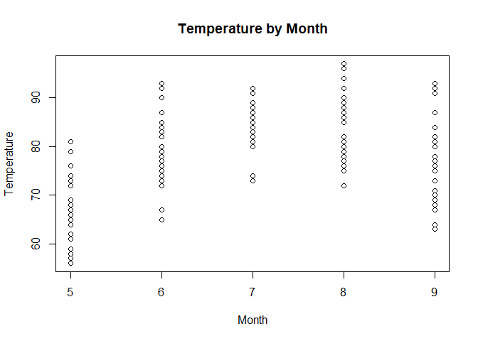
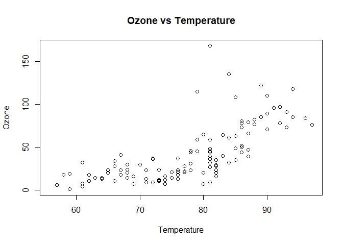
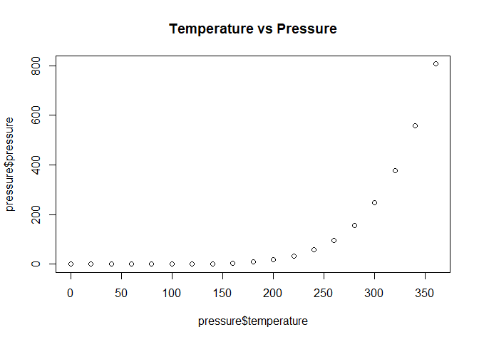
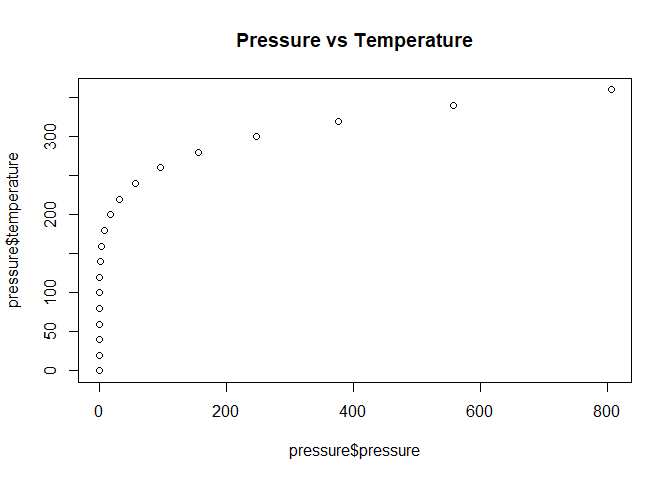

# Q1: Put the following questions into RMarkdown as headers.

## What is a basic workflow for reproducible research?
Overall, you gather the data, then you analyze the data, and finally you present the results.

## What are five practical tips for make research reproducible?
1. Document everything.
2. Everything is a file (preferably text).
3. All files should be human readable.
4. Explicitly tie your files together.
5. Have a plan to organize, store, and make your files available.

## Give an example of how you might implement each tip.
To document everything, comment on all of your code and print session info. For everything is a file, this means that you should save your work in the simplest format possible, which is usually a text format, so that it is future-proof. This also ties in to the third tip, because text files are able to be read by humans. Commenting your code also helps with this. To tie files together, have a file that use "tie commands" that lays out the links between your files. Finally, organize your code in folders and subfolders so that they are modular.

## Which one of these do you think will be the most difficult?
I think the hardest part comes with documenting everything. Generally you want to focus on your research and forget to slow down and make sure everything is written out.

# Q2: Air Quality Code


```r
plot(x=airquality$Month, y=airquality$Temp, xlab = "Month", ylab = "Temperature", main = "Temperature by Month")
```

<!-- -->


```r
plot(x=airquality$Temp, y=airquality$Ozone, xlab = "Temperature", ylab = "Ozone", main = "Ozone vs Temperature")
```

<!-- -->

# Q3: Pressure Code


```r
plot(x=pressure$temperature, y=pressure$pressure, main = "Temperature vs Pressure" )
```

<!-- -->


```r
plot(x=pressure$pressure, y=pressure$temperature, main = "Pressure vs Temperature")
```

<!-- -->

