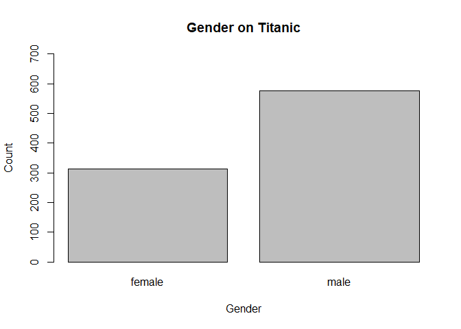
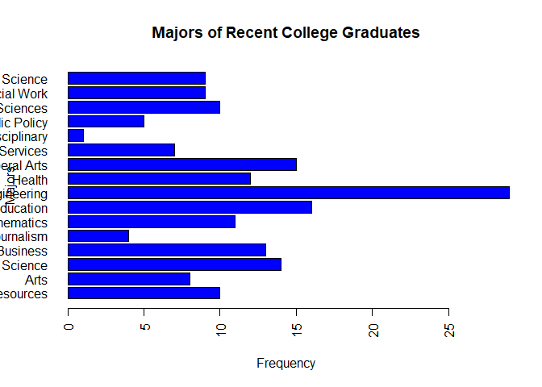

```r
sessionInfo()
```

```
## R version 3.5.3 (2019-03-11)
## Platform: x86_64-w64-mingw32/x64 (64-bit)
## Running under: Windows 10 x64 (build 18362)
## 
## Matrix products: default
## 
## locale:
## [1] LC_COLLATE=English_United States.1252 
## [2] LC_CTYPE=English_United States.1252   
## [3] LC_MONETARY=English_United States.1252
## [4] LC_NUMERIC=C                          
## [5] LC_TIME=English_United States.1252    
## 
## attached base packages:
## [1] stats     graphics  grDevices utils     datasets  methods   base     
## 
## loaded via a namespace (and not attached):
##  [1] compiler_3.5.3  magrittr_1.5    tools_3.5.3     htmltools_0.3.6
##  [5] yaml_2.2.0      Rcpp_1.0.1      stringi_1.4.3   rmarkdown_1.12 
##  [9] knitr_1.22      stringr_1.4.0   xfun_0.6        digest_0.6.18  
## [13] evaluate_0.13
```


# Q1. Github Cloning

```bash
# cd school/repos
# mkdir awesome_public_datasets
# git clone https://github.com/caesar0301/awesome-public-datasets awesome_public_datasets/
```

# Q2. Data Summary


```r
setwd("C://Users//rachel//school//repos//awesome_public_datasets//Datasets")
df <- read.csv("titanic.csv/titanic.csv")
summary(df$Sex)
```

```
## female   male 
##    314    577
```

```r
barplot(summary(df$Sex), main = "Gender on Titanic", xlab = "Gender", ylab = "Count", ylim = c(0,700))
```

<!-- -->

```r
df2 = data.frame(df$Age, df$Fare, df$Survived)
sapply(df2, mean, na.rm = T)
```

```
##      df.Age     df.Fare df.Survived 
##  29.6991176  32.2042080   0.3838384
```

# Q3. Function Building

```r
path <- "C://Users//rachel//School//repos//MSDS_6306//HW//HW3//sleep_data_01.csv"
report <- function(file) {
  df <- read.csv(file)
  med <- median(df$Age, na.rm = T)
  min <- min(df$Duration, na.rm = T)
  max <- max(df$Duration, na.rm = T)
  m_rses <- mean(df$RSES, na.rm = T)
  sd_rses <- sd(df$RSES, na.rm = T)
  report <- data.frame(med, m_rses/5, sd_rses/5, max-min)
  names(report) <- c("MedianAge", "SelfEsteem", "SE_SD", "DurationRange")
  sapply(report, round, 2)
}
report(path)
```

```
##     MedianAge    SelfEsteem         SE_SD DurationRange 
##         14.00          3.62          1.24          7.00
```

# Q4. FiveThirtyEight Data

```r
library("fivethirtyeight")
df <- college_recent_grads
vignette("fivethirtyeight", package = "fivethirtyeight")
```

```
## starting httpd help server ... done
```

```r
article <- "The Economic Guide to Picking a College Major"
# url: http://fivethirtyeight.com/features/the-economic-guide-to-picking-a-college-major/
dim(df)
```

```
## [1] 173  21
```

```r
names(df)
```

```
##  [1] "rank"                        "major_code"                 
##  [3] "major"                       "major_category"             
##  [5] "total"                       "sample_size"                
##  [7] "men"                         "women"                      
##  [9] "sharewomen"                  "employed"                   
## [11] "employed_fulltime"           "employed_parttime"          
## [13] "employed_fulltime_yearround" "unemployed"                 
## [15] "unemployment_rate"           "p25th"                      
## [17] "median"                      "p75th"                      
## [19] "college_jobs"                "non_college_jobs"           
## [21] "low_wage_jobs"
```

# Q5. Data Summary

```r
names(df)
```

```
##  [1] "rank"                        "major_code"                 
##  [3] "major"                       "major_category"             
##  [5] "total"                       "sample_size"                
##  [7] "men"                         "women"                      
##  [9] "sharewomen"                  "employed"                   
## [11] "employed_fulltime"           "employed_parttime"          
## [13] "employed_fulltime_yearround" "unemployed"                 
## [15] "unemployment_rate"           "p25th"                      
## [17] "median"                      "p75th"                      
## [19] "college_jobs"                "non_college_jobs"           
## [21] "low_wage_jobs"
```

```r
ncol(df)
```

```
## [1] 21
```

```r
major_count <- table(df$major_category)
par(las=2)
barplot(major_count, main = "Majors of Recent College Graduates", horiz = T, ylab = "Majors", xlab = "Frequency", col = "blue")
```

<!-- -->

```r
write.csv(df,file = "recent_college_grads.csv", row.names = F)
```

# Q6. Codebook
Github repository: https://github.com/LonghornRach/MSDS_6306
