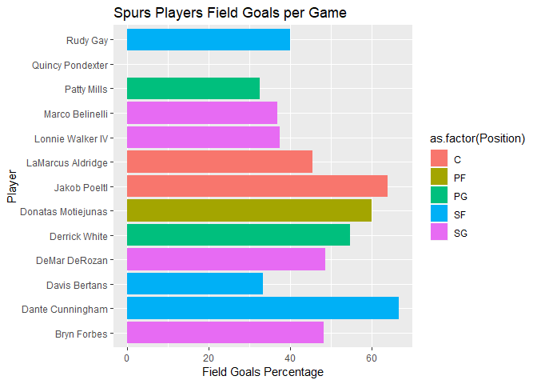

```r
sessionInfo()
```

```
## R version 3.5.3 (2019-03-11)
## Platform: x86_64-w64-mingw32/x64 (64-bit)
## Running under: Windows 10 x64 (build 18362)
## 
## Matrix products: default
## 
## locale:
## [1] LC_COLLATE=English_United States.1252 
## [2] LC_CTYPE=English_United States.1252   
## [3] LC_MONETARY=English_United States.1252
## [4] LC_NUMERIC=C                          
## [5] LC_TIME=English_United States.1252    
## 
## attached base packages:
## [1] stats     graphics  grDevices utils     datasets  methods   base     
## 
## loaded via a namespace (and not attached):
##  [1] compiler_3.5.3  magrittr_1.5    tools_3.5.3     htmltools_0.3.6
##  [5] yaml_2.2.0      Rcpp_1.0.1      stringi_1.4.3   rmarkdown_1.12 
##  [9] knitr_1.22      stringr_1.4.0   xfun_0.6        digest_0.6.18  
## [13] evaluate_0.13
```

```r
library(rvest)
```

```
## Loading required package: xml2
```

```r
library(stringr)
library(dplyr)
```

```
## 
## Attaching package: 'dplyr'
```

```
## The following objects are masked from 'package:stats':
## 
##     filter, lag
```

```
## The following objects are masked from 'package:base':
## 
##     intersect, setdiff, setequal, union
```

```r
library(ggplot2)
```

# Question 1: Harry Potter Scraping
First, get the table in a data frame.

```r
url <- 'https://www.imdb.com/title/tt1201607/fullcredits?ref_=tt_ql_1'
hp_raw <- read_html(url)
hp_data <- html_node(hp_raw, ".cast_list")
hp_table <- html_table(hp_data)
str(hp_table)
```

```
## 'data.frame':	152 obs. of  4 variables:
##  $ X1: chr  "" "" "" "" ...
##  $ X2: chr  "" "Ralph Fiennes" "Michael Gambon" "Alan Rickman" ...
##  $ X3: chr  "" "..." "..." "..." ...
##  $ X4: chr  "" "Lord Voldemort" "Professor Albus Dumbledore" "Professor Severus Snape" ...
```
Next, clean the data.

```r
harry <- hp_table[, c(2, 4)]
names(harry) <- c("Firstname", "Character")
harry$Character[11] <- "Griphook / Professor Filius Flitwick"
harry$Character <- gsub(" \\n ", "", harry$Character)
harry_clean <- harry[-c(1,93),]
harry_clean$Surname <- word(harry_clean$Firstname, -1)
harry_clean$Firstname <- gsub("\\s*\\w*$", "", harry_clean$Firstname)
harry_clean <- harry_clean[,c("Firstname", "Surname", "Character")]
head(harry_clean, 10)
```

```
##    Firstname   Surname                            Character
## 2      Ralph   Fiennes                       Lord Voldemort
## 3    Michael    Gambon           Professor Albus Dumbledore
## 4       Alan   Rickman              Professor Severus Snape
## 5     Daniel Radcliffe                         Harry Potter
## 6     Rupert     Grint                          Ron Weasley
## 7       Emma    Watson                     Hermione Granger
## 8     Evanna     Lynch                        Luna Lovegood
## 9   Domhnall   Gleeson                         Bill Weasley
## 10  Clémence     Poésy                       Fleur Delacour
## 11   Warwick     Davis Griphook / Professor Filius Flitwick
```

# Question 2: ESPN Scraping
First, obtain the data.

```r
spurs_url <- "http://www.espn.com/nba/team/stats/_/name/sa/san-antonio-spurs"
spurs_raw <- read_html(spurs_url)
spurs_data_1 <- html_node(spurs_raw, ".Table2__right-aligned.Table2__table-fixed.Table2__Table--fixed--left.Table2__table")
spurs_table_1 <- html_table(spurs_data_1)
spurs_data_2 <- html_nodes(spurs_raw, "table")
spurs_data_2_2 <- html_nodes(spurs_data_2, "table")
spurs_data_3 <- html_table(spurs_data_2_2[6])
spurs_table_2 <- data.frame(spurs_data_3)
spurs_table_2 <- spurs_table_2 %>% mutate(id = row_number())
spurs_table_1 <- spurs_table_1 %>% mutate(id = row_number())
spurs <- merge(spurs_table_1, spurs_table_2)
```
Now, clean up the data.

```r
spurs$Position <- word(spurs$Name, -1)
spurs$Name <- gsub("\\s*\\w*$", "", spurs$Name)
spurs <- spurs[1:13,c(2,17,3:16)]
```
Finally, make the bar chart.

```r
ggplot(spurs, aes(x=Name, y=FG., fill=as.factor(Position))) + geom_bar(stat='identity') + coord_flip() + labs(y="Field Goals Percentage", x="Player") + ggtitle("Spurs Players Field Goals per Game")
```

<!-- -->

